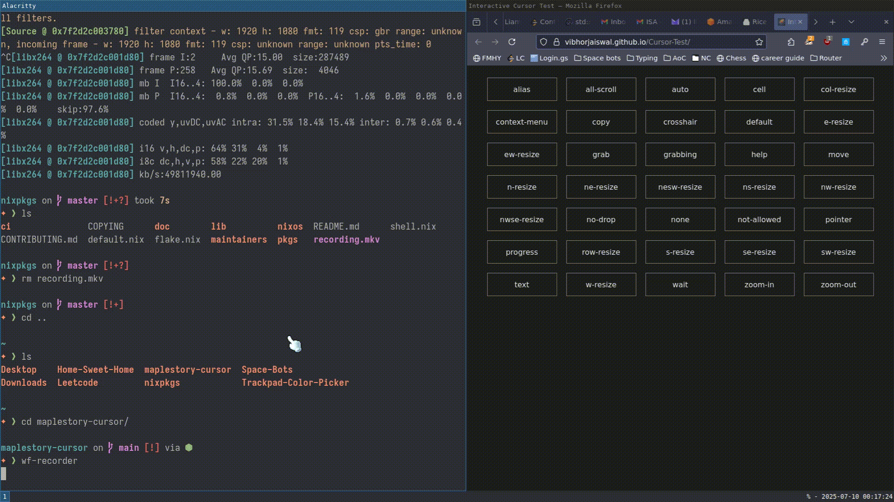

# maplestory-cursor

A custom animated cursor theme inspired by MapleStory, a fork of the popular [banana-cursor (f3a3d1940c14c966735b696be96d233b1a83d1b4)](https://github.com/ful1e5/banana-cursor/tree/f3a3d1940c14c966735b696be96d233b1a83d1b4).



Developed on NixOS + Sway, but probably works on all major operating systems if installed using [banana-cursor v1.0.0 install instructions](https://github.com/ful1e5/banana-cursor/tree/f3a3d1940c14c966735b696be96d233b1a83d1b4).

## 🐧📦 NixOS + Sway Installation

Working on getting this in the [Nix store](https://search.nixos.org/packages?channel=unstable&from=0&size=50&sort=relevance&type=packages&query=maplestory-cursor).

A sample system wide configuration:
```
{ config, pkgs, lib, ... }:

{
  environment.variables = {
    XCURSOR_THEME = "Maple";
    XCURSOR_SIZE = "64";
  };

  programs.sway.enable = true;

  services.udev.extraRules = ''
    ACTION=="add|change", SUBSYSTEM=="input", ENV{LIBINPUT_DEVICE_GROUP}=="1", ENV{XCURSOR_THEME}="Maple", ENV{XCURSOR_SIZE}="64"
  '';

  environment.sessionVariables = {
    GDK_SCALE = "1";
    GDK_BACKEND = "wayland";
    XCURSOR_THEME = "Maple";
    XCURSOR_SIZE = "64";
  };

  environment.systemPackages = with pkgs; [ maplestory-cursor ];
}
```

In sway config:
```
seat * xcursor_theme Maple 64
```
the size: 64x64 was picked here as an example but feel free to change to any in the list belobut feel free to change to any in the list below. The original size of the cursor is 32x32.

## Cursor Sizes

<kbd>16</kbd>
<kbd>20</kbd>
<kbd>22</kbd>
<kbd>24</kbd>
<kbd>28</kbd>
<kbd>32</kbd>
<kbd>40</kbd>
<kbd>48</kbd>
<kbd>56</kbd>
<kbd>64</kbd>
<kbd>72</kbd>
<kbd>80</kbd>
<kbd>88</kbd>
<kbd>96</kbd>

## Credits

- Based on [banana-cursor](https://github.com/ful1e5/banana-cursor) by [ful1e5](https://github.com/ful1e5)

- All art and animations originally from [maplestory-cursor](https://github.com/zaytri/maplestory-cursors) by [zaytri](https://github.com/zaytri)

- Cursor testing [website shown in preview](https://vibhorjaiswal.github.io/Cursor-Test/) by [vibhorjaiswal](https://github.com/VibhorJaiswal)
